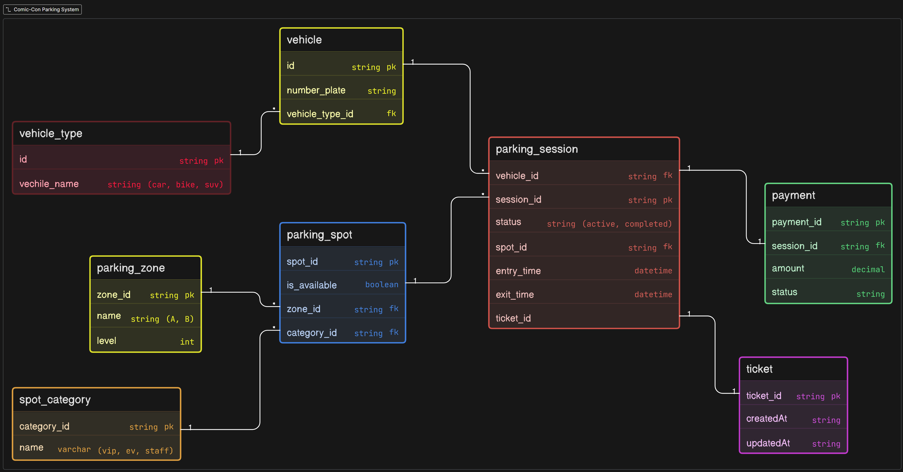

# Comic-Con Parking System Database Design

This project contains the ER diagram for a parking system used in a large event like Comic-Con.

---

## Features Modeled

* Vehicle and vehicle types (car, bike, SUV, etc.)
* Parking zones (A, B, different levels)
* Parking spots inside each zone
* Spot categories (VIP, EV, staff)
* Parking sessions (entry and exit of vehicles)
* Ticket generation when vehicle enters
* Payment tracking when vehicle exits

---

## Key Design Decisions

* Each vehicle visit is stored as a **ParkingSession**
* One vehicle can come multiple times → multiple sessions
* Parking spots can be reused for different sessions
* Ticket is linked to a session (not directly to vehicle)
* Payment is linked to a session for clear tracking
* Zone and category are separated for better structure

---

## How the System Works (Simple Flow)

1. Vehicle enters the parking
2. System creates a ParkingSession
3. A parking spot is assigned
4. A ticket is generated
5. Vehicle stays in parking
6. Vehicle exits
7. Payment is completed

---

## Diagram

