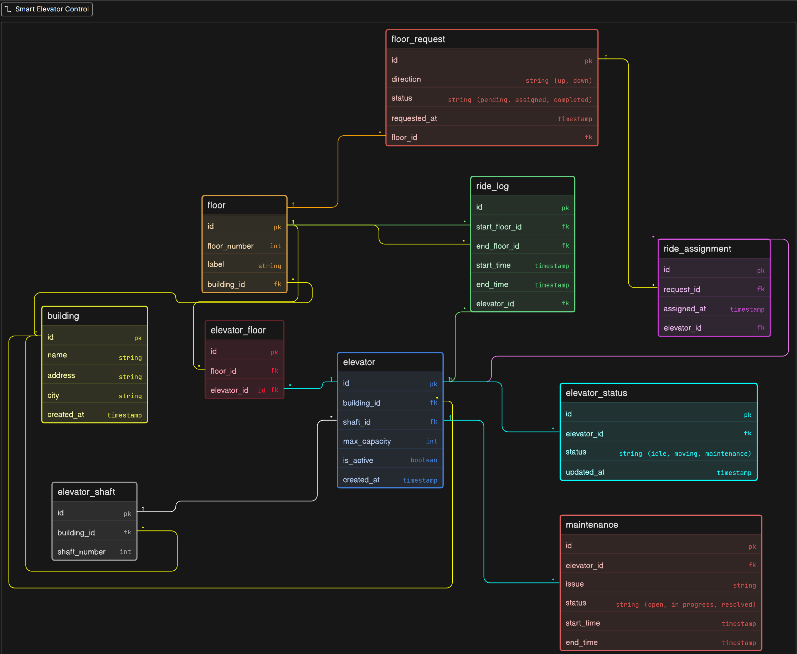

# Smart Elevator Control System

This project contains the ER diagram for a smart elevator system used in buildings like offices, malls, and apartments.

---

## 🚀 Features

- Multiple buildings support
- Multiple elevators in each building
- Floors inside each building
- Elevator–floor mapping
- Floor request system (up/down buttons)
- Ride assignment to elevators
- Ride history (logs)
- Elevator status tracking
- Maintenance tracking

---

## 🧠 Key Ideas

- Buildings contain floors and elevators
- Elevators can serve multiple floors
- Floors can be served by multiple elevators
- Requests are stored separately (not inside elevator)
- Each request is assigned to one elevator
- Ride logs are stored for history
- Status and maintenance are tracked separately

---

## ⚙️ How it Works

1. User presses button on a floor
2. System creates a request
3. Elevator is assigned
4. Elevator completes the ride
5. Ride is stored in logs
6. Status keeps updating
7. Maintenance is tracked when needed

---

## 📊 What You Can Track

- Buildings and floors
- Elevators in each building
- Which elevator serves which floor
- Pending and completed requests
- Ride count per elevator
- Elevator status (idle, moving, maintenance)
- Maintenance history

---

## 🖼️ Diagram

