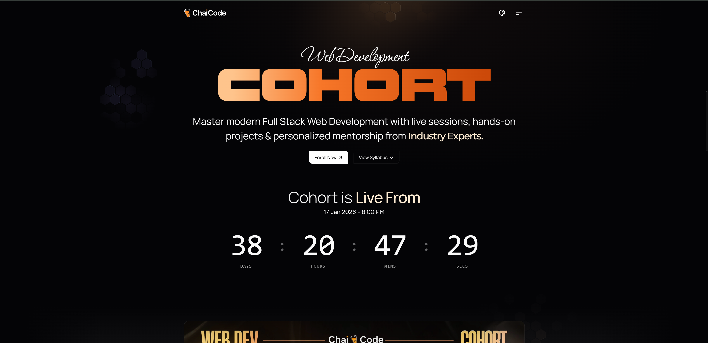

# 🚀 Ashish – Web Development Journey



Welcome to my Web Development learning repository.

This repo documents my structured journey through  
**ChaiCode – Web Dev Cohort 2.0**.

---

## 📈 Progress Tracker

### 🌐 Fundamentals
- [x] Introduction to Computer Networks  
- [x] What is Internet  
- [x] WWW Overview  
- [x] DNS Basics  
- [ ] HTTP / HTTPS  
- [ ] TCP / UDP Deep Dive  

---

### ⚡ JavaScript
- [x] JavaScript Fundamentals  
- [x] Functions & Scope  
- [x] Objects & Arrays  
- [ ] Asynchronous JavaScript  
- [ ] DOM Manipulation  
- [ ] Event Handling  
- [ ] Fetch API  

---

### 📘 HTML
- [ ] HTML Structure  
- [ ] Semantic HTML  
- [ ] Forms & Inputs  
- [ ] Validation  

---

### 🎨 CSS
- [ ] Box Model  
- [ ] Flexbox  
- [ ] Grid  
- [ ] Responsive Design  

---

### 🔷 TypeScript
- [ ] Type System  
- [ ] Interfaces & Types  
- [ ] Generics  

---

### 🚀 Backend
- [ ] Node.js Fundamentals  
- [ ] HTTP Server  
- [ ] Express.js  
- [ ] REST APIs  
- [ ] Databases  
- [ ] Authentication  

---

### ⚛ React
- [ ] React Fundamentals  
- [ ] Hooks  
- [ ] Routing  
- [ ] State Management  

---

## 🧠 About This Repository

This is my personal knowledge base + practice lab where I:

✔ Document concepts clearly  
✔ Revise core topics  
✔ Write hands-on code  
✔ Build real-world projects  
✔ Track my progress publicly  

---

## 🎯 Cohort Learning Coverage

### 🌐 Fundamentals
- Computer Networks  
- Internet & WWW  
- DNS & Domain Resolution  
- Client–Server Architecture  
- Internet Protocols  
- HTTP / HTTPS / TLS / SSL  
- WebSockets / WebRTC  

---

### 🛠 Developer Tools
- VS Code  
- Terminal  
- Git & GitHub  
- AI-assisted development  

---

### 📘 HTML – Building Blocks
- HTML Structure  
- Semantic HTML  
- Forms & Inputs  
- Validation & Accessibility  

---

### 🎨 CSS – Styling & Layout
- Box Model  
- Flexbox  
- Grid  
- Responsive Design  

---

### ✨ Advanced CSS
- Pseudo Classes & Elements  
- Animations & Transitions  
- Gradients & Shadows  
- Bootstrap / Tailwind  

---

### ⚡ JavaScript
- Fundamentals  
- Functions & Scope  
- Objects & Data Types  
- ES6+ Features  
- OOP  
- Async JS  
- DOM  
- Events  
- Fetch API  
- Advanced Concepts  

---

### 🔷 TypeScript
- Type System  
- Interfaces & Types  
- Generics  
- Tooling  

---

### 🚀 Backend Engineering
- Node.js  
- HTTP Server  
- Express.js  
- REST APIs  
- File System  
- Databases  
- Authentication  
- WebSockets  
- Rate Limiting  
- Redis / Kafka  
- Logging / Monitoring  
- Deployment  

---

### ⚛ React
- Components  
- Props  
- State  
- Hooks  
- Routing  
- Forms  
- Performance  
- Advanced Patterns  

---

### 🔥 Full Stack
- Next.js  
- SSR / SSG / ISR  
- API Routes  
- Server Actions  

---

### 🤖 AI Integrations
- GenAI / LLMs  
- Workflows / Agents  
- Inngest  

---

### 🐳 DevOps
- Docker  
- Cloud Concepts  
- AWS  

---

### 🏗 Production Projects
- Auth Systems  
- Authorization Engines  
- Scalable APIs  
- AI-powered Apps  
- RAG Systems  

---

## 🧰 Tech Stack (In Progress)


---

## 📂 Repository Structure

```bash
WEB-DEV-COHORT-2.0/
│
├── 📘 1-HTML/
├── 🎨 2-CSS/
├── ⚡ 3-JavaScript/
├── 🔷 4-TypeScript/
├── 🚀 5-Backend/
├── ⚛ 6-React/
├── 🔥 7-FullStack/
│
├── assets/
└── README.md
```

---

## ✨ Learning Philosophy

> **Understand → Practice → Revise → Build**

I focus on:

- Deep conceptual clarity  
- Writing clean code  
- Hands-on experimentation  
- Building real projects  
- Continuous improvement  

---

## 🔥 Goals

- Master full stack development  
- Become interview-ready  
- Build production-grade systems  
- Develop strong problem-solving skills  
- Think like an engineer  

---

## 🌱 Progress Mindset

Web development is a marathon.

Consistency, curiosity, and patience win.

---

✨ *Building skills one commit at a time.*
